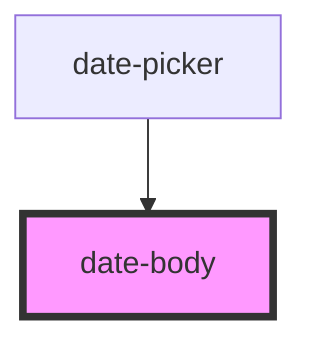

# date-body

<!-- Auto Generated Below -->

## Properties

| Property | Attribute | Description | Type          | Default |
| -------- | --------- | ----------- | ------------- | ------- |
| `dates`  | --        |             | `DateObj[][]` | `[]`    |

## Events

| Event     | Description | Type                |
| --------- | ----------- | ------------------- |
| `dateSel` |             | `CustomEvent<Date>` |

## Dependencies

### Used by

 - [date-picker](../date-picker)

### Graph

----------------------------------------------

*Built with [StencilJS](https://stenciljs.com/)*
