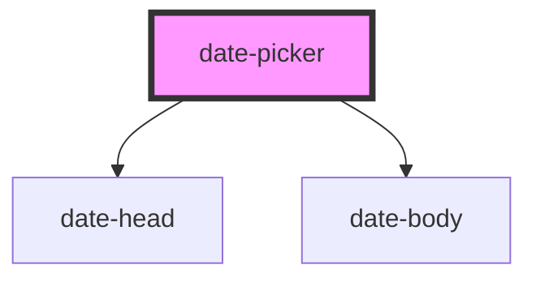

# date-picker

<!-- Auto Generated Below -->

## Properties

| Property | Attribute | Description | Type                | Default  |
| -------- | --------- | ----------- | ------------------- | -------- |
| `height` | `height`  |             | `number`            | `355`    |
| `show`   | `show`    |             | `"false" \| "true"` | `"true"` |
| `width`  | `width`   |             | `number`            | `300`    |

## Events

| Event   | Description | Type                   |
| ------- | ----------- | ---------------------- |
| `ready` |             | `CustomEvent<boolean>` |

## Dependencies

### Depends on

- [date-head](../date-head)
- [date-body](../date-body)

### Graph

----------------------------------------------

*Built with [StencilJS](https://stenciljs.com/)*
